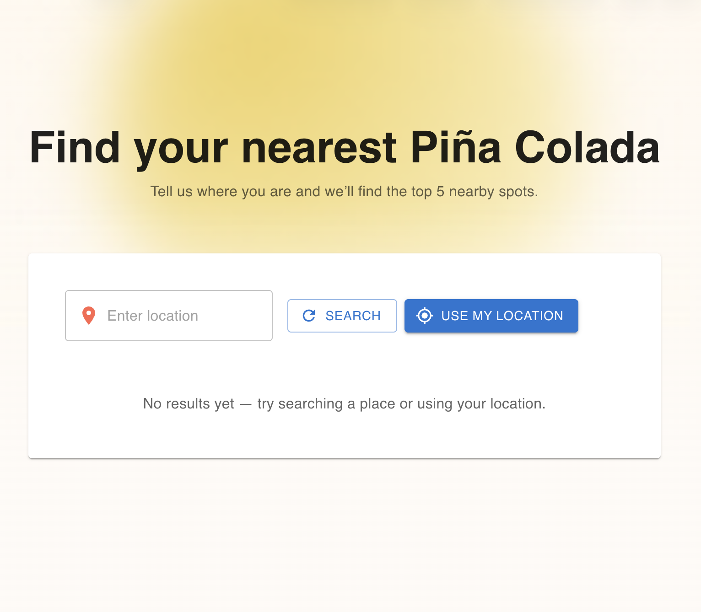
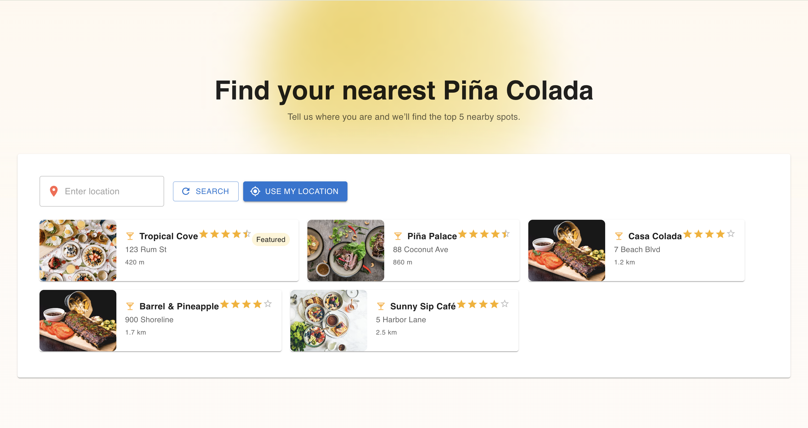

# 🍍 Where's My Piña?

A fun lightweight app that helps you find the **top 5 nearest Piña Colada spots** near you — whether it’s a café, bar, or restaurant!  
Built with **React (Vite)** on the frontend and **Flask + Yelp API/Google Maps Platform** on the backend.

---

## ✨ Features
- Search for Piña Colada places by typing a location or using your current GPS location.
- Responsive, mobile-friendly layout using **Material-UI (MUI)**.
- Animated transitions with **Framer Motion**.
- Real data powered by the **Yelp Fusion API**.

---

## 🖼 Screenshots

### 🔍 Landing View



### 🍹 Results View



---

## 🚀 Run Locally

### 🖥 Frontend
```bash
cd Frontend
npm install
npm run dev
```

### 🖥 Backend
```bash
cd Backend
python run.py
```

### 🔑 Before You Run

Make sure you have a **Yelp API key**.  
You can get one for free by creating an account at [Yelp Developers](https://www.yelp.com/developers/v3/manage_app).

Create a `.env` file in your backend folder and add:
```bash
YELP_API_KEY=your_yelp_api_key_here
```

Then visit: 👉 [http://localhost:5173](http://localhost:5173)

and make sure your Flask backend runs on: 👉 [http://127.0.0.1:5000](http://127.0.0.1:5000)
 
 ---

## 🧠 Tech Stack

- **Frontend:** React + Vite + MUI + Framer Motion  
- **Backend:** Python + Flask + Geopy  
- **API Data Source:** Yelp Fusion API / Google Maps Platform

---

## 💛 Inspiration
Built for fun — because finding the perfect Piña Colada should be as easy and refreshing as drinking one. 🍹

